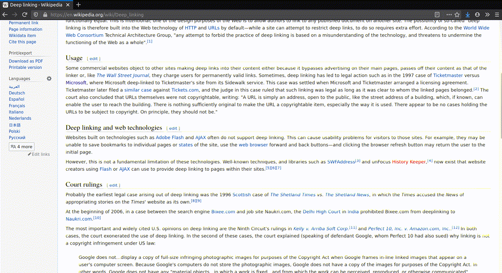

# Deep Dive

*A web extension to deep link to any text on the web.*

## Install
- [Firefox Extension](https://addons.mozilla.org/en-US/firefox/addon/deep-dive/)

## Usage

1. Highlight text on page to which a link is to be generated
2. Right-click and select "Copy Deep Link"
3. Open the link in a new browser tab 
   This should jump to the text and highlight it

### Demo

## Mechanics

1. [ScrollToTextFragment](https://github.com/WICG/ScrollToTextFragment#tldr) format for deep links
2. [Window.find](https://developer.mozilla.org/en-US/docs/Web/API/Window/find) to jump to and highlight specified text on page

## Notes

* The deep link jumps to the first instance of the highlighted text it finds on the page  
  To ensure you jump to the right portion, highlight a large enough region so that it's unique (or at least the first)
* Without the extension, deep link will behave like plain links. That is, page opens, doesn't jump to text
